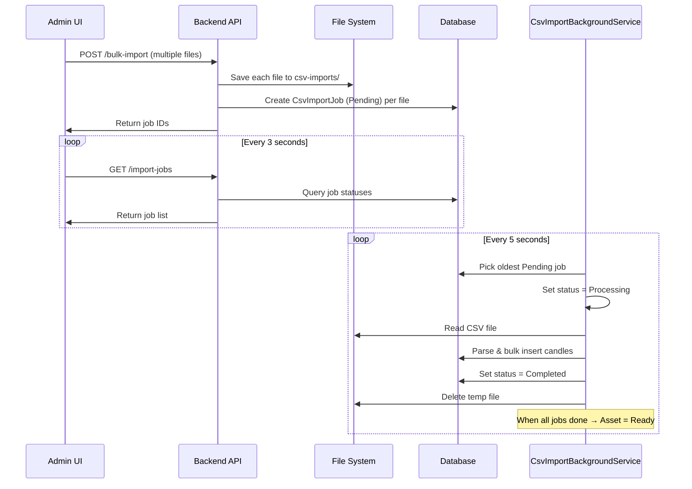

# Walkthrough: Bulk CSV Upload with Background Processing

## Summary

Implemented a feature to upload multiple CSV historical data files at once for a backtest asset. Files are queued and processed sequentially by a background service, with real-time progress visible in the UI.

## Backend Changes

### New Files

| File | Purpose |
|------|---------|
| [CsvImportStatus.cs](file:///c:/project/.NET/trading-journal-backend/modules/Backtest/TradingJournal.Modules.Backtest/Common/Enums/CsvImportStatus.cs) | Enum: `Pending`, `Processing`, `Completed`, `Failed` |
| [CsvImportJob.cs](file:///c:/project/.NET/trading-journal-backend/modules/Backtest/TradingJournal.Modules.Backtest/Domain/CsvImportJob.cs) | Domain entity tracking each uploaded CSV file and its processing status |
| [BulkUploadCsvFiles.cs](file:///c:/project/.NET/trading-journal-backend/modules/Backtest/TradingJournal.Modules.Backtest/Features/V1/Admin/BulkUploadCsvFiles.cs) | `POST /{assetId}/bulk-import` — accepts multiple files, saves to disk, creates job records |
| [GetImportJobs.cs](file:///c:/project/.NET/trading-journal-backend/modules/Backtest/TradingJournal.Modules.Backtest/Features/V1/Admin/GetImportJobs.cs) | `GET /{assetId}/import-jobs` — returns job statuses for frontend polling |
| [CsvImportBackgroundService.cs](file:///c:/project/.NET/trading-journal-backend/modules/Backtest/TradingJournal.Modules.Backtest/Services/CsvImportBackgroundService.cs) | Background service that processes one job at a time every 5 seconds |

### Modified Files

| File | Change |
|------|--------|
| [IBacktestDbContext.cs](file:///c:/project/.NET/trading-journal-backend/modules/Backtest/TradingJournal.Modules.Backtest/Infrastructure/IBacktestDbContext.cs) | Added `DbSet<CsvImportJob>` |
| [BacktestDbContext.cs](file:///c:/project/.NET/trading-journal-backend/modules/Backtest/TradingJournal.Modules.Backtest/Infrastructure/BacktestDbContext.cs) | Added `CsvImportJobs` DbSet + Fluent API config with FK + index |
| [DependencyInjection.cs](file:///c:/project/.NET/trading-journal-backend/modules/Backtest/TradingJournal.Modules.Backtest/DependencyInjection.cs) | Registered `CsvImportBackgroundService` |

### EF Migration
- Generated migration `AddCsvImportJobs` for the new `CsvImportJobs` table

## Frontend Changes

| File | Change |
|------|--------|
| [admin-api.ts](file:///c:/project/.NET/trading-journal-ui/lib/admin-api.ts) | Added `CsvImportJobDto`, `bulkUploadCsvFiles()`, `getImportJobs()` |
| [page.tsx](file:///c:/project/.NET/trading-journal-ui/app/admin/assets/page.tsx) | Added `BulkUploadDialog` component with drag-and-drop, file list, upload button, and real-time job progress panel |

## How It Works

## Validation

- ✅ Backend compiles with 0 errors, 0 warnings
- ✅ Frontend builds successfully (exit code 0)
- ✅ EF migration generated
